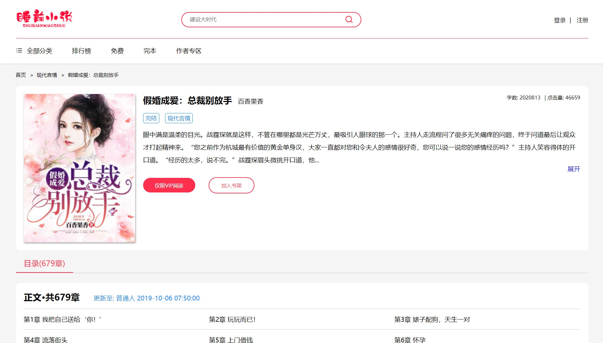
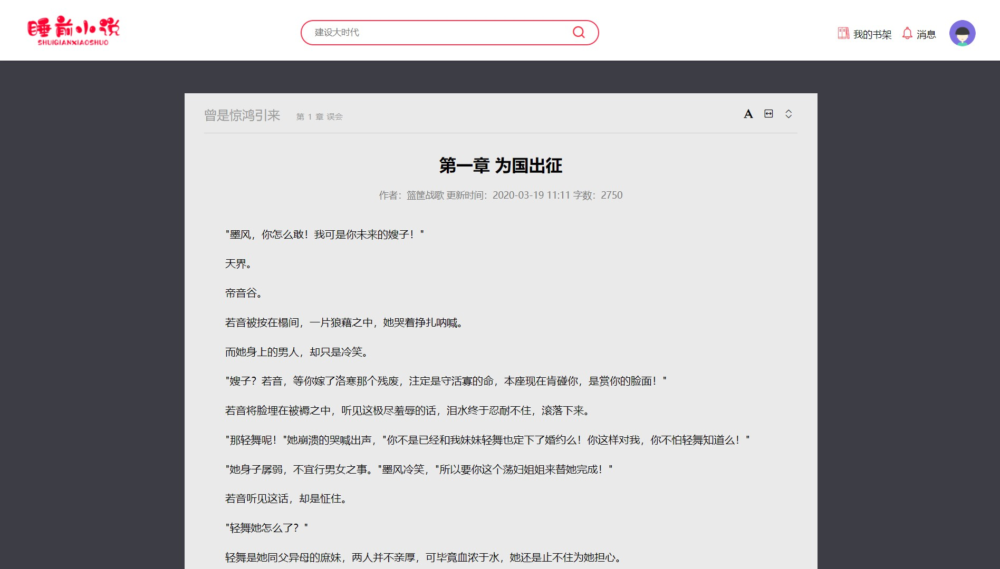

# Tiểu thuyết-Tĩnh

Trang web tĩnh mới lạ, dữ liệu có thể được truy cập, hầu hết các trang đều có sẵn và trang web có thể được xây dựng nhanh chóng với giao diện back-end

## Dự án này là bài tập cuối cùng của JS trước đó sớm nhất. Giao diện là dịch vụ JSONP do chính tôi xây dựng. Dữ liệu sách là có thật và có thể thay đổi giao diện gắn kết

